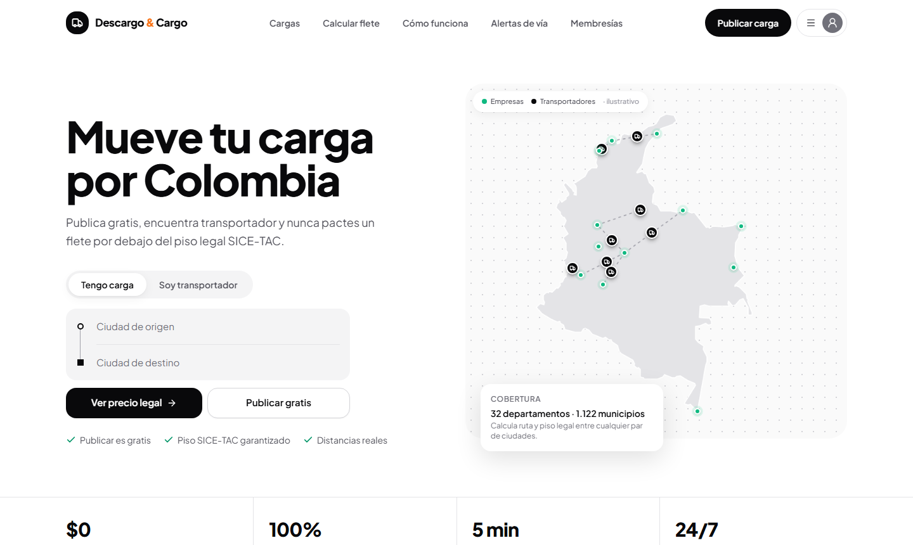

# Descargo & Cargo

**Marketplace de carga por carretera para Colombia.** Las empresas publican su carga gratis y los transportadores la encuentran, sin pactar nunca un flete por debajo del piso legal SICE-TAC.

🌐 **[descargoycargo.com](https://descargoycargo.com)** · En lanzamiento



## Qué hace

**Para quien despacha carga**
- Publica cargas gratis, con cálculo de distancia real entre municipios y validación del piso tarifario SICE-TAC antes de publicar.
- Recibe un aviso cuando un transportador se interesa, con sus datos y la placa del vehículo para verificarla en el RUNT.
- Genera una constancia de entrega lista para imprimir y firmar.

**Para el transportador**
- Busca cargas por origen, destino y tipo de publicación.
- Desbloquea el contacto del publicador con pago en línea (Nequi, PSE o tarjeta, vía Wompi).
- Guarda sus contactos desbloqueados y lleva el registro de gastos de cada viaje (ACPM, peajes, recibos) para saber cuánto le quedó del flete.
- Recibe alertas de vía cerca de su ubicación.

**En general**
- Ingreso con correo o celular.
- Tratamiento de datos conforme a la Ley 1581 de 2012: consentimiento versionado, derecho de supresión desde la cuenta y Política de Datos pública.

## Tecnología

| Capa | Herramientas |
|---|---|
| Frontend (`app/`) | React 19, TypeScript, Vite, Tailwind CSS, shadcn/ui, Leaflet |
| Backend (`server/`) | Node.js, Express 5, Prisma, Zod |
| Pagos y correo | Wompi (Web Checkout + webhooks firmados), Resend |
| Mapas y rutas | OpenStreetMap (Nominatim + OSRM) |
| Infraestructura | VPS Linux con systemd, Cloudflare Tunnel |

El mismo proceso de Node sirve la API y el frontend compilado.

## Estructura

```
app/        Frontend (React)
server/     API, esquema de base de datos (Prisma) y pruebas
legal/      Borradores de Términos y Política de Datos
docs/       Guías de infraestructura
marketing/  Piezas gráficas
deploy.sh   Redespliegue en el servidor
```

## Desarrollo local

Requiere Node.js 22 o superior.

```bash
# API
cd server
npm install
cp .env.example .env        # completar las variables
npx prisma migrate dev
npm run seed                # cuentas y cargas de demostración
npm run dev                 # http://localhost:4000

# Frontend (en otra terminal)
cd app
npm install
npm run dev                 # http://localhost:3000
```

Pruebas del backend: `cd server && npm test`.

## Licencia

© 2026 DESCARGO Y CARGO S.A.S. Todos los derechos reservados. El código se publica solo para consulta; no se autoriza su copia, modificación ni uso comercial sin permiso escrito. **Descargo & Cargo** es una marca registrada ante la Superintendencia de Industria y Comercio de Colombia.
